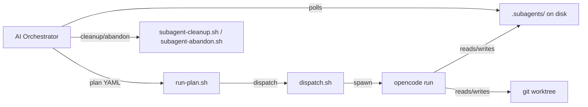

# Architecture

dispatch-opencode is a single bounded context — **subagent dispatch** —
with no internal sub-contexts. The skill sits between an AI orchestrator
(Claude Code, Codex, etc.) and opencode's `opencode run` CLI, translating
high-level dispatch intent into background processes with file-based
signaling.

## C4 context

## Components

**Scripts** (`scripts/`). Shell scripts that do the work. `run-plan.sh`
validates and dispatches from a plan YAML. `dispatch.sh` handles
single-task prepare and spawn. `subagent-cleanup.sh` and
`subagent-abandon.sh` manage teardown. `cleanup-stale.sh` recovers
orphaned resources. `verify-cwd.sh` and `validate-run.sh` enforce
safety invariants.

**Templates** (`templates/cli/`). Jinja2-style shell templates — one
per dispatch kind. Rendered into `start-subagent.sh` by `dispatch.sh`.
Currently: `single-file-fix.sh.j2` and `headless-spike.sh.j2`.

**On-disk artifacts** (`.subagents/<task-id>/`). The task directory is
the source of truth. Contains: `prompt.md`, `start-subagent.sh`,
`.lock` (while running), `events.jsonl`, `FINAL_OUTPUT.md`. If the task
declared a worktree, `worktree/` lives here too.

**Worktrees** (`.subagents/<task-id>/worktree/`). Git worktrees created
by `run-plan.sh` during dispatch. Symlinked from `.worktrees/<task-id>/`
for discovery by other tooling. Lifecycle is bound to the task
directory.

## Key design rules

1. Every dispatch takes an explicit absolute path; verification fails
   closed.
2. Every handoff is an on-disk artifact under `.subagents/`.
3. One template per dispatch kind.
4. Smart orchestrator, dumb subagents — the orchestrator decides what
   is ready; subagents never coordinate.

## Detail

- `docs/architecture/` — expanded component diagrams, protocol flows,
  artifact schemas
- `docs/adr/` — decision records (ADR-001: async lock-watch as primary
  mode)