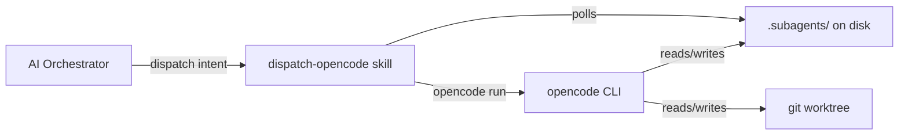

# Architecture

dispatch-opencode is a single bounded context — **subagent dispatch** — with no internal sub-contexts. The skill sits between an AI orchestrator (Claude Code, Codex, etc.) and opencode's `opencode run` CLI, translating high-level dispatch intent into background processes with file-based signaling.

## C4 context

## Components

**Scripts** (`scripts/`). Shell scripts that do the work. `dispatch.sh` handles single-task async dispatch. `orchestrate.sh` handles 1-to-N parallelize. `worktree-prepare.sh`, `worktree-complete.sh`, and `worktree-abandon.sh` manage the worktree lifecycle. `collect-results.sh` aggregates results. `verify-cwd.sh` and `validate-run.sh` enforce safety invariants.

**Templates** (`templates/cli/`). Jinja2-style shell templates — one per dispatch kind. Rendered into `start-subagent.sh` by `dispatch.sh`. Currently: `single-file-fix.sh.j2` and `headless-spike.sh.j2`.

**Runtime adapters** (`templates/runtimes/`). Thin shims that let different AI hosts invoke the skill. Claude Code's slash command adapter lives here. Adapters handle how the orchestrator *calls* the skill, not how the skill invokes the subagent.

**On-disk artifacts** (`.subagents/<task-id>/`). The task directory is the source of truth. Contains: `prompt.md`, `start-subagent.sh`, `.lock` (while running), `events.jsonl`, `FINAL_OUTPUT.md`.

**Worktrees** (`.worktrees/<label>/`). Git worktrees created by the orchestrator before dispatch. Each subagent operates on an isolated branch.

## Key design rules

1. Every dispatch takes an explicit absolute path; verification fails closed.
2. Every handoff is an on-disk artifact under `.subagents/`.
3. One template per dispatch kind.
4. Smart orchestrator, dumb subagents — the orchestrator decides what is ready; subagents never coordinate.

## Detail

- `docs/architecture/` — expanded component diagrams, protocol flows, artifact schemas
- `docs/adr/` — decision records (ADR-001: async lock-watch as primary mode)