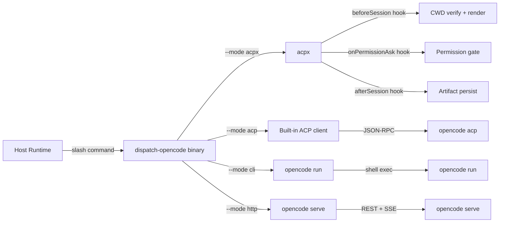

# dispatch-opencode v2 system contracts

## Design Intent

**Context:** v1 implements ACP transport, session lifecycle, and permission relay from scratch. acpx already solves ~70% of that surface with more adapters and more maturity. v2 layers on top of acpx instead of re-implementing ACP client logic.

### Goals

- Shed ACP client internals (JSON-RPC framing, initialize/newSession/prompt round-trips, permission-ask dispatch, idle detection, crash recovery) by delegating to acpx.
- Preserve the five capabilities dispatch-opencode uniquely provides: per-kind permission allowlists, on-disk dispatch artifacts, Jinja2 prompt templates, CWD verification, and cross-host skill adapters.
- Keep the three non-negotiable constraints from v1: the skill owns the working directory, handoffs are on-disk artifacts, and one template per dispatch kind.
- Make dispatch-opencode installable as an acpx adapter plugin so `acpx run --adapter dispatch-opencode` works out of the box.
- Keep the standalone binary for operators who do not want acpx.

### Constraints

- acpx must be an optional dependency; the standalone binary works without it.
- The per-kind permission allowlist must survive the delegation boundary. dispatch-opencode injects its allowlist into acpx's permission hook, not the other way around.
- On-disk artifact layout under `.dispatch-opencode/<task-id>/` must remain backward-compatible. v1 dispatches must stay inspectable.
- The config file (`.dispatch-opencode/config.yaml`) must work for both standalone and acpx modes without duplication.
- No new dispatch kinds in v2 — only re-architecture of the transport layer.

### Non-goals

- Rewriting acpx or forking it. Dispatch-opencode is a consumer, not a fork.
- Supporting non-ACP transports through acpx (if acpx adds HTTP or CLI adapters, that is their scope).
- Building an MCP server. opencode is an MCP client only.
- Providing a visual dashboard or TUI for dispatch history.
- General-purpose subagent orchestration beyond the three existing kinds.

## Interface Surface

This design covers the system boundary between dispatch-opencode v2 and three classes of caller:

1. **Host runtimes** (Claude Code, Codex, Gemini, Cursor) — invoke the skill via their native extension mechanism.
2. **acpx** — as an adapter plugin, acpx delegates session setup and transport. dispatch-opencode handles permission policy, template rendering, and artifact persistence.
3. **Direct CLI** — operators run `dispatch-opencode` without acpx for fire-and-forget dispatches.

The boundary is the `dispatch-opencode` binary's public interface: flags, exit codes, artifact layout, and the acpx integration contract.

## Contract Definition

### Binary interface (standable and acpx mode)

| Element | v1 | v2 | Change |
|---------|----|----|--------|
| `--kind` | required | required | No change. |
| `--cwd` | required | required | No change. |
| `--model` | required | required | No change. |
| `--agent` | required | required | No change. |
| `--prompt-file` | required | required | No change. |
| `--mode` | `acp \| cli \| http` | `acp \| cli \| http \| acpx` | New `acpx` mode: delegates transport to acpx, keeps dispatch-opencode for policy and artifacts. |
| `--target-file` | conditional | conditional | No change. |
| `--timeout` | optional | optional | No change. |
| `--adapter-config` | — | optional path | Path to `acpx-adapter.yaml` when running under acpx. Standalone mode ignores this. |
| Exit 0 | success | success | No change. |
| Exit 2 | partial failure | partial failure | No change. |
| Exit 124 | timeout | timeout | No change. |

### acpx adapter contract

When dispatch-opencode is installed as an acpx adapter, it satisfies this contract:

```yaml
# acpx-adapter.yaml — placed in acpx's adapter discover path
name: dispatch-opencode
version: "2.0.0"
type: skill
hooks:
  beforeSession:
    run: dispatch-opencode --mode acpx before-session
    provides: [cwd_verified, permission_policy, prompt_parts]
  onPermissionAsk:
    run: dispatch-opencode --mode acpx permission-ask
    provides: [decision, reason]
  afterSession:
    run: dispatch-opencode --mode acpx after-session
    provides: [artifacts_dir, exit_code, validate_result]
config:
  defaults: .dispatch-opencode/config.yaml
  schema: acpx-adapter-schema.json
```

The three hooks map directly to v1's existing phases:

| v1 phase | acpx hook | What dispatch-opencode owns |
|----------|-----------|-----------------------------|
| CWD verify + config load | `beforeSession` | `cwd_verified`, loaded `config.yaml`, rendered `prompt_parts` and `prompt.md`. |
| Per-kind permission gate | `onPermissionAsk` | The `make_permission_handler` logic (allow, reject, target_only, bash_readonly). Injected as acpx's permission callback. |
| Artifact persist + validate | `afterSession` | Write `events.jsonl`, `stdout.log`, `session.json` to `.dispatch-opencode/<task-id>/`. Run `validate-run.sh`. |

### Artifact directory contract (backward-compatible)

```
.dispatch-opencode/
  <task-id>/
    prompt.md              # raw prompt text (unchanged)
    prompt-parts.json       # ACP parts array (unchanged)
    prompt.json             # ACP prompt request body (unchanged)
    session.json            # session metadata (unchanged)
    events.jsonl            # JSON-RPC / SSE event stream (unchanged)
    stdout.log              # text deltas (unchanged)
    stderr.log              # spawned-process stderr (unchanged)
    dispatch.sh             # CLI mode only (unchanged)
    transport-meta.json     # NEW: { "mode": "acpx"|"acp"|"cli"|"http", "acpx_version": "..." }
```

`transport-meta.json` is the only new file. Existing v1 artifacts remain readable without it.



## Behavioral Guarantees

| Guarantee | Mechanism | v2 change |
|-----------|-----------|-----------|
| CWD is a verified git work tree | `verify-cwd.sh` runs before any dispatch | No change — same script, same fail-closed logic. |
| Permission decisions follow per-kind allowlist | `make_permission_handler` | In acpx mode, the same callable is injected into acpx's `onPermissionAsk` hook. Logic is identical. |
| Every dispatch produces on-disk artifacts | Write to `.dispatch-opencode/<task-id>/` before sending | No change. acpx mode adds `transport-meta.json`. |
| Timeouts are enforced | `--timeout` propagates to acpx session or ACP prompt request | acpx mode: passed via `beforeSession` config. ACP mode: unchanged. |
| Stalls do not block forever | async timeout + process kill | acpx mode: acpx owns process lifecycle. dispatch-opencode's `afterSession` hook runs regardless. |
| Autocompact is disabled | `OPENCODE_DISABLE_AUTOCOMPACT=true` in spawned env | acpx mode: passed via adapter env config. ACP mode: unchanged. |
| Attach URL is logged | Print `opencode attach <url> --session <id>` | acpx mode: acpx logs the attach URL; dispatch-opencode echoes it from `afterSession`. ACP mode: unchanged. |

## Integration Patterns

### Standalone invocation (no acpx)

```bash
dispatch-opencode \
  --kind single-file-fix \
  --cwd /path/to/repo \
  --model ollama-cloud/glm-5.1 \
  --agent build \
  --target-file src/foo.py \
  --prompt-file /tmp/prompt.md
```

Identical to v1. The binary includes its own ACP client, CLI renderer, and HTTP driver.

### acpx adapter invocation

```bash
acpx run \
  --adapter dispatch-opencode \
  --kind single-file-fix \
  --cwd /path/to/repo \
  --model ollama-cloud/glm-5.1 \
  --target-file src/foo.py \
  --prompt-file /tmp/prompt.md
```

acpx handles: `opencode acp` spawn, `initialize`, `newSession`, `prompt` transport, idle detection, crash recovery, and multi-agent routing.

dispatch-opencode handles: CWD verification, permission policy, template rendering, and artifact persistence.

The `--kind`, `--cwd`, `--model`, and `--prompt-file` flags are forwarded through acpx's adapter mechanism to dispatch-opencode's `beforeSession` hook.

### Cross-host adapter invocation (unchanged)

Claude Code, Codex, Gemini, and Cursor each have a template under `templates/runtimes/<host>/`. These translate the host's native extension mechanism into `dispatch-opencode` flags. No changes in v2.

## Evolution Rules

| Aspect | Rule |
|--------|------|
| Binary flags | Additive only. Existing flags and their semantics do not change between minor versions. |
| Artifact layout | New files may be added to the task dir; existing files keep their names and schemas. `transport-meta.json` is the only v2 addition. |
| Permission allowlist | Per-kind rules may expand (allow more) but never silently restrict in a minor version. New kinds get their own allowlist row. |
| acpx adapter contract | The three-hook shape (`beforeSession`, `onPermissionAsk`, `afterSession`) is stable. New hooks may be added; existing hooks' `provides` lists are append-only. |
| Config file | New keys may be added. Existing keys keep their defaults and semantics. Removing a key requires a major version bump. |
| Template rendering | Template variables are append-only. Removing a template variable requires a major version bump. |

## Edge Cases and Error States

| Condition | Behavior | v2-specific? |
|-----------|----------|-------------|
| acpx not installed, `--mode acpx` selected | Fail with: "acpx not found on PATH; install acpx or use --mode acp/cli/http" | Yes |
| acpx crashes mid-session | `afterSession` hook still runs (acpx guarantees hook execution on crash). Artifacts may be partial — `events.jsonl` contains what was captured. | Yes |
| Permission handler raises an exception | Reject the tool call (same as v1). Log the exception. | No |
| `--mode acpx` with `--mode cli` flags mixed | `--mode` is mutually exclusive. Error at parse time. | No |
| acpx version incompatible with adapter contract | Dispatch-opencode checks `acpx --version` in `beforeSession`. If below minimum (TBD), fail with version mismatch message. | Yes |
| v1 artifact dir inspected by v2 binary | No `transport-meta.json` present — v2 infers `mode: acp` from presence of `events.jsonl` with JSON-RPC shape. | Yes |

## Design Decisions

1. **Layer on acpx, don't fork.** acpx has 2.3k stars, 24 releases, and 15+ agent adapters. acpx already handles initialize, sessions, prompt, cancel, reconnect, and crash recovery. The adapter-plugin model keeps dispatch-opencode's unique value (permission policy, templates, artifacts) while shedding transport maintenance.

2. **Permission policy stays in dispatch-opencode.** dispatch-opencode's per-kind allowlist (target_only, bash_readonly, reject-by-default) is strictly more conservative than acpx's defaults. Injecting it as an adapter hook preserves the fail-closed posture.

3. **Standalone binary survives.** Not every consumer has acpx. The binary's `--mode acp` path keeps the v1 ACP client code. A thin wrapper around acpx internals is a v3 concern.

4. **No new dispatch kinds.** v2 is a re-architecture, not a feature release. Adding kinds (e.g., `multi-file-refactor`, `test-gen`) can happen in v2.1+ without changing the adapter contract.

5. **`transport-meta.json` is opt-in metadata.** v1 artifacts read fine without it. v2 writes it on every dispatch. Tools that crawl `.dispatch-opencode/` should handle its absence gracefully.

## Assets

- `skills/dispatch-opencode/bin/dispatch-opencode` — v1 binary (1106 lines). v2 refactors into transport-agnostic core + mode-specific dispatchers.
- `skills/dispatch-opencode/SKILL.md` — v1 design contract (390 lines). v2 adds acpx adapter section and updates the mode table.
- `skills/dispatch-opencode/templates/acp/` — ACP prompt templates; unchanged in v2.
- `skills/dispatch-opencode/templates/runtimes/` — cross-host adapters; unchanged in v2.

## Lifecycle

| Phase | Date | Commit | Notes |
|-------|------|--------|-------|
| Active | 2026-04-29 | — | Initial creation — user-requested, fully developed in-session. |
| Superseded | 2026-05-25 | — | Superseded by ADR-001 — ACP/acpx approach replaced with async .subagents/ lock-watch dispatch. |